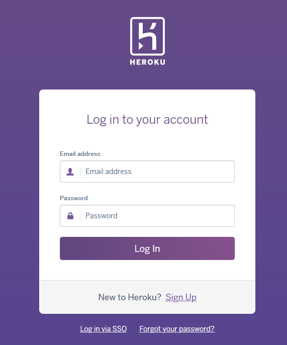
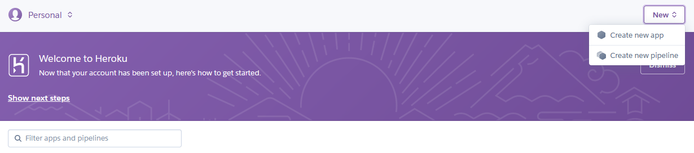
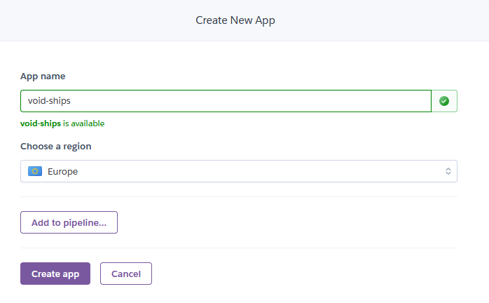
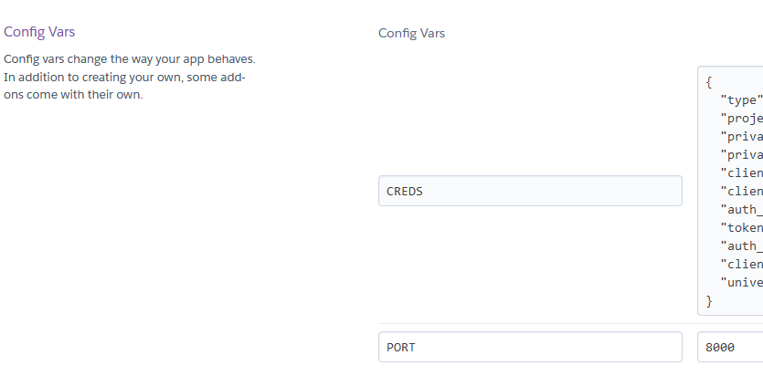
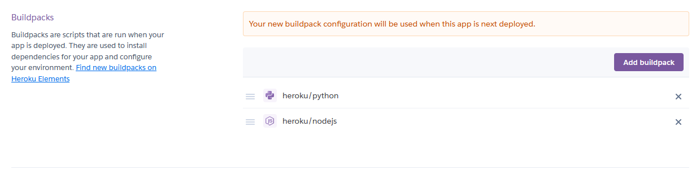
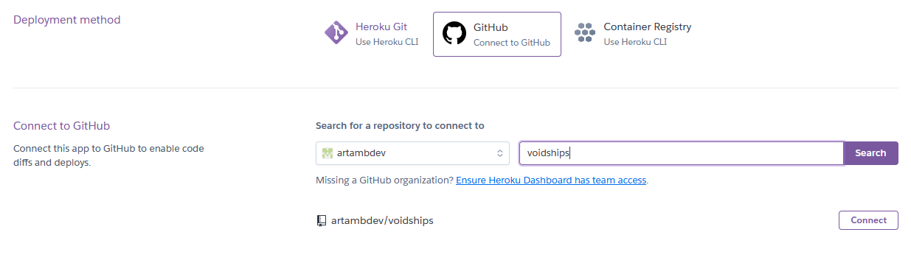
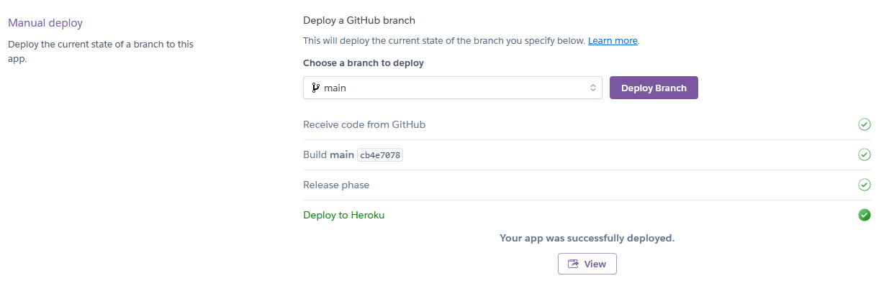

# Voidships
- developed by Arthur Ambalov

## Table of Contents
1. [Overview](#overview)
2. [User Stories](#user-stories)
3. [Design](#design)
4. [Features](#features)
5. [Validation](#validation)
6. [Bugs](#bugs)
7. [Deployment](#deployment)
8. [Credits](#credits)

## Overview
Voidships is a terminal-based online game based off the classic Battleships design. Users can make a persistent account and play the game versus a computer opponent.

## User Stories
The website is designed for two possible users and  user stories:

### User: Player
- 1. As a player, I want to be able to play a Battleships esque game in full
- 2. As a player, I want to 
- 3. As a player, I want feedback on what me and the other player do
- 4. As a player, I want to be able to sign up for an account
- 5. As a player, I want feedback on any mistakes I make while signing up
- 6. As a player, I want to be able to log into my existing account to play again

### User: Site Owner
- 7. As the site owner, I want to allow users to sign up for an account
- 8. As the site owner, I want to easily review how many people have played the game
- 9. As the site owner, I want players to understand where they make wrong inputs and what to do
- 10. As the site owner, I want account data to be validated to avoid abuse

## Design
I made a flowchart using Lucidchart to map out the basic game flow and where inputs are expected of users, and how their outcome should feed back into the game flow.

Flowchart

## Deployment
The project was deployed using the online platform Heroku. The following steps were taken:
1. Log in or sign up to the Heroku website:

Image

2. Click the "new" button and then "Create a new app"

Image

3. Choose an app name and region to use, Europe in my case

Image

4. Navigate to the "Settings" tab of the new app and set the config vars: PORT as 8000, and CREDS as the project's creds.json used for the Google Sheets user database

Image

5. Navigate to the "Buildpacks" section of this page and add Python as a buildpack, and then the nodejs buildpack, so that Python is above nodejs

Image

6. Go to the "Deploy" page and select GitHub as a deploy method, log in via GitHub and then select the desired repository

Image

7. Go to "Manual deploy", make sure the main branch is selected, and click "Deploy"

Image

### Forking
On this project's repository, at the upper-right-hand side, there is a "fork" button to create a fork of it.

### Cloning
On this project's repository, at the upper-right-hand side, there is a "Code" button. To clone the project, click the button and:
- Choose between HTTPS, SSH or GitHub CLI as preferred and click the "Copy url to clipboard" button
- Open Git Bash
- Set the working directory to where the cloned project should be
- Type "git clone " followed by the copied URL
- Hit enter to create the cloned project

## Credits
Technology used:
- Languages: Python
- IDE: GitPod
- Version control: GitHub
- Deployment: Heroku
- Flowchart: Lucidchart

Third party libraries:
- <a href="https://pypi.org/project/colorama/">Colorama</a> for coloured text

Code:
- Code for Python terminal provided by Code Institute

Other:
- http://www.patorjk.com for ASCII art generator used for the logo
- Mo Shami for mentoring, guidance and feedback throughout the project.