# Voidships
- developed by Arthur Ambalov

## Table of Contents
1. [Overview](#overview)
2. [User Stories](#user-stories)
3. [Design](#design)
4. [Features](#features)
5. [Data Model](#data-model)
6. [Validation](#validation)
7. [Bugs](#bugs)
8. [Deployment](#deployment)
9. [Credits](#credits)

## Overview
Voidships is a terminal-based online game based off the classic Battleships design. Users can make a persistent account and play the game versus a computer opponent.

## User Stories
The website is designed for two possible users and 10 user stories:

### User: Player
- 1. As a player, I want to be welcomed to the app in a visually pleasing way
- 2. As a player, I want to be able to play a Battleships esque game in full
- 3. As a player, I want to be able to easily understand how the game is progressing
- 4. As a player, I want feedback on what me and the other player do
- 5. As a player, I want to be able to sign up for an account
- 6. As a player, I want feedback on any mistakes I make while signing up
- 7. As a player, I want to be able to log into my existing account to play again
- 8. As a player, I want to be able to personalize my experience
- 9. As a player, I want to be able to replay the game easily

### User: Site Owner
- 10. As the site owner, I want to allow users to sign up for an account
- 11. As the site owner, I want players to understand where they make wrong inputs and what to do
- 12. As the site owner, I want account data to be validated to avoid abuse

## Design
I made a flowchart using Lucidchart to map out the basic game flow and where inputs are expected of users, and how their outcome should feed back into the game flow.

Flowchart

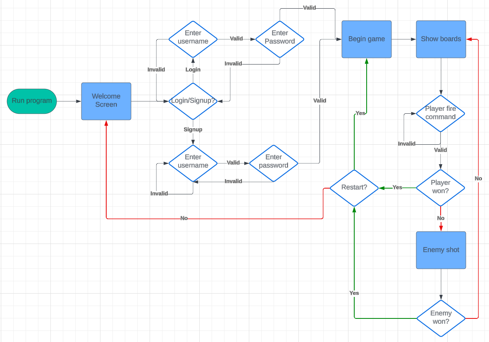

## Features

### Welcome Screen
When opening the game or declining to restart a finished game, a welcome screen pops up with a logo and some lore. This is immediately followed by the login/signup prompt. Text pops in line-by-line for a cinematic and smooth feel.
User stories: 1

Welcome

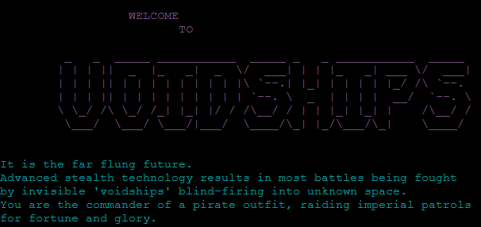

### Signup
Players without an existing account can type N to start creating a new account, and are prompted to choose a username and password. The data inputted is validated against a user database hosted on Google Sheets and has some requirements to avoid abuse, such as a minimum character count and requirement for unique usernames.
User stories: 5, 6, 9, 10

Signup

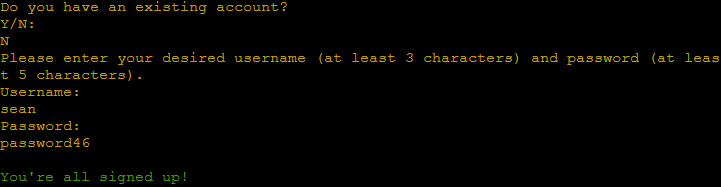

### Login
Players with an existing account can log in by entering a username or password, which is checked against the database. Failure to enter a valid combination returns them to the login/signup prompt in case they are mistaken and need to make a new account.
User stories: 7, 12

Login

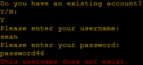

### Name Choice
Before playing the player is first offered a chance to name their captain, whose name appears above their board.
User stories: 8

Naming

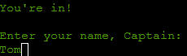

### Boards
The player and enemy boards are displayed each round so the player can keep track of where they want to shoot, and how well the computer player is doing.
User stories: 3, 4

Board Display

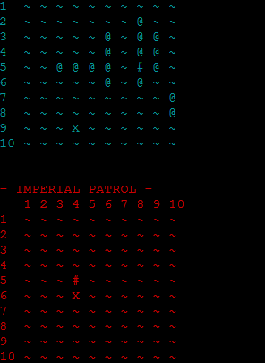

### Player shots
The player is prompted to pick an enemy space to shoot each round. Invalid selections such as those outside the board or that aren't two sets of numbers are rejected and a new shot is asked for until a valid one is inputted. Afterwards, the result is printed to give immediate feedback on if a hit was made or not.
User stories: 2, 4, 11

Player Shots

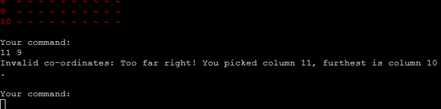

### Enemy shots
After the player, the computer player automatically takes its turn. The computer plays with some intelligence such as prioritizing firing at spaces adjacent to those it has found ships on. Feedback for its actions is also printed to the player.
User stories: 2, 4

Enemy Shots

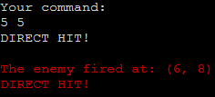

### Victory screen
If the player destroys all enemy ships, they are given a big victory screen to congratulate them.
User stories: 2, 3

Victory

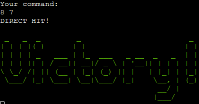

### Defeat screen
If the computer player destroys all player ships, the player is given a defeat screen.
User stories: 2, 3

Defeat

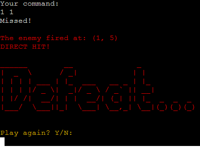

### Retry option
After a victory or defeat, the player is offered to play again, or not. If they restart, a new battle begins. If they do not, they are brought back to the welcome screen.

Retry

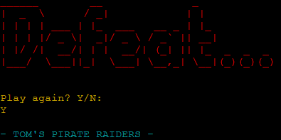

## Data Model
The player and enemy boards are programmed as "Board" classes, which handle many functions in regards to game mechanics. This includes:
- Placing ships - and validating where they can be placed
- Printing out the board visual
- Choosing good locations for the computer player to fire at
- Storing a list of the board's columns

Boards store their spaces, which are also individual classes. Each space stores:
- Its location in its board's grid
- Whether it contains a ship or not
- If it has been fired at or not
The spaces also handle the behaviour when they are shot, appropriately changing their variables and reporting into the terminal whether the shot was a hit or miss.

## Validation

### Python
<a href="https://pep8ci.herokuapp.com/">PEP8 Python Linter</a> was used to validate all three Python files and no errors are returned.
The validator was provided by Code Institute.

run.py

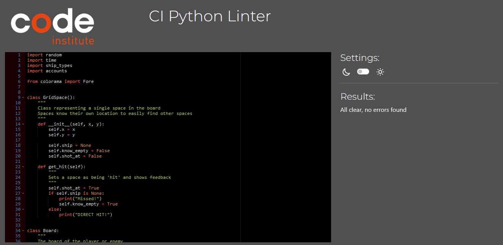

accounts.py

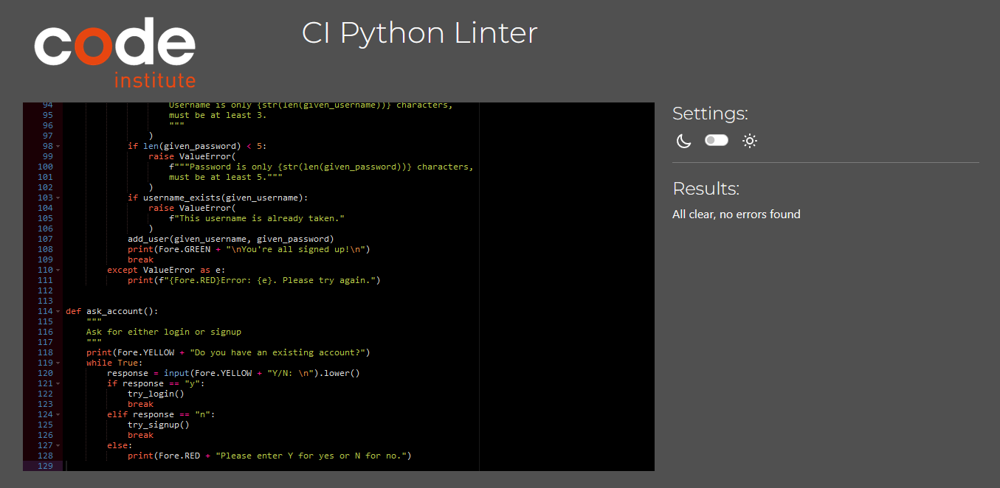

ship_types.py

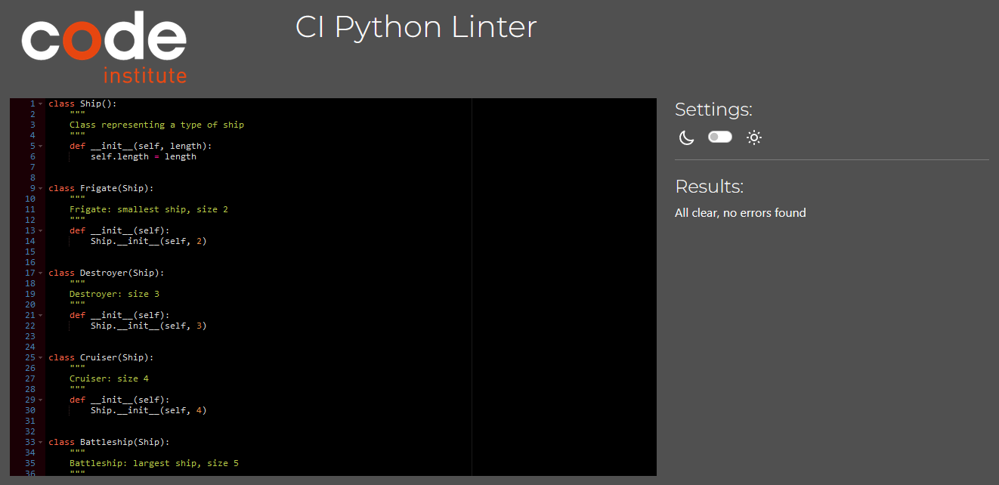

### User Stories

Below is a list of user stories and the process by which they are fulfilled:

1. As a player, I want to be welcomed to the app in a visually pleasing way

| **Feature** | **Action** | **Expected Result** | **Actual Result** |
|-------------|------------|---------------------|-------------------|
| Welcome screen | Open the program | Find a nice welcome screen | Works as expected |

Screenshot

2. As a player, I want to be able to play a Battleships esque game in full

| **Feature** | **Action** | **Expected Result** | **Actual Result** |
|-------------|------------|---------------------|-------------------|
| Player shots | Enter a set of grid coordinates | A turn is taken in the game | Works as expected |
| Enemy shots | Successfully complete a turn | The enemy takes a turn as well | Works as expected |

Screenshot

3. As a player, I want to be able to easily understand how the game is progressing

| **Feature** | **Action** | **Expected Result** | **Actual Result** |
|-------------|------------|---------------------|-------------------|
| Board visuals | Open the game or take a turn | The display updates with the current game progress visually displayed | Works as expected |

Screenshot

4. As a player, I want feedback on what me and the other player do

| **Feature** | **Action** | **Expected Result** | **Actual Result** |
|-------------|------------|---------------------|-------------------|
| Player shots | Enter a set of grid coordinates and press enter | Receive feedback on the shot, or the reason it is invalid | Works as expected |
| Enemy shots | Enter a set of grid coordinates and press enter | Receive feedback on what the computer decided to do | Works as expected |

Screenshot

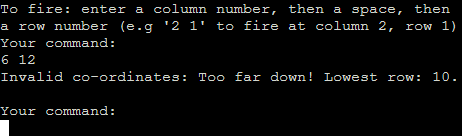

5. As a player, I want to be able to sign up for an account

| **Feature** | **Action** | **Expected Result** | **Actual Result** |
|-------------|------------|---------------------|-------------------|
| Signup | At the welcome screen, type N and press enter, then enter a username and password | Create a persistent account to play with | Works as expected |

Screenshot

6. As a player, I want feedback on any mistakes I make while signing up

| **Feature** | **Action** | **Expected Result** | **Actual Result** |
|-------------|------------|---------------------|-------------------|
| Signup | Enter a name that is too short, or already taken | The signup is rejected and feedback is given | Works as expected |

Screenshot

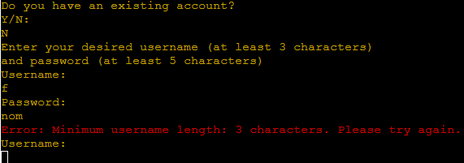

7. As a player, I want to be able to log into my existing account to play again

| **Feature** | **Action** | **Expected Result** | **Actual Result** |
|-------------|------------|---------------------|-------------------|
| Login | At the welcome screen, type Y and enter your username and password | Log in to an existing account | Works as expected |

Screenshot

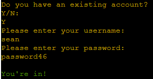

8. As a player, I want to be able to personalize my experience

| **Feature** | **Action** | **Expected Result** | **Actual Result** |
|-------------|------------|---------------------|-------------------|
| Name choice | At the welcome screen, log in or sign up for an account | Be prompted to choose a captain's name for the session | Works as expected |

Screenshot

9. As a player, I want to be able to replay the game easily

| **Feature** | **Action** | **Expected Result** | **Actual Result** |
|-------------|------------|---------------------|-------------------|
| Reply function | Complete the game by destroying all enemy ships or losing all your ships | The game prompts the player for a restart | Works as expected |

Screenshot

10. As the site owner, I want to allow users to sign up for an account

| **Feature** | **Action** | **Expected Result** | **Actual Result** |
|-------------|------------|---------------------|-------------------|
| Signup | At the welcome screen, type N and press enter, then enter a username and password | Create a persistent account to play with | Works as expected |

Screenshot

11. As the site owner, I want players to understand where they make wrong inputs and what to do

| **Feature** | **Action** | **Expected Result** | **Actual Result** |
|-------------|------------|---------------------|-------------------|
| Player shots | Enter a set of grid coordinates outside the board | Receive feedback on the reason the choice is invalid | Works as expected |
| Signup | Enter a name that is too short, or already taken | The signup is rejected and feedback is given | Works as expected |

Screenshot

12. As the site owner, I want account data to be validated to avoid abuse

| **Feature** | **Action** | **Expected Result** | **Actual Result** |
|-------------|------------|---------------------|-------------------|
| Player shots | Enter a set of grid coordinates outside the board | Receive feedback on the reason the choice is invalid | Works as expected |
| Signup | Enter name or password that's too short | The new account is rejected and a reason given why | Works as expected |

Screenshot

## Deployment
The project was deployed using the online platform Heroku. The following steps were taken:
1. Log in or sign up to the Heroku website:

Image

2. Click the "new" button and then "Create a new app"

Image

3. Choose an app name and region to use, Europe in my case

Image

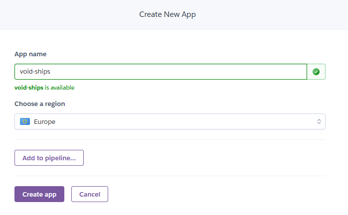

4. Navigate to the "Settings" tab of the new app and set the config vars: PORT as 8000, and CREDS as the project's creds.json used for the Google Sheets user database

Image

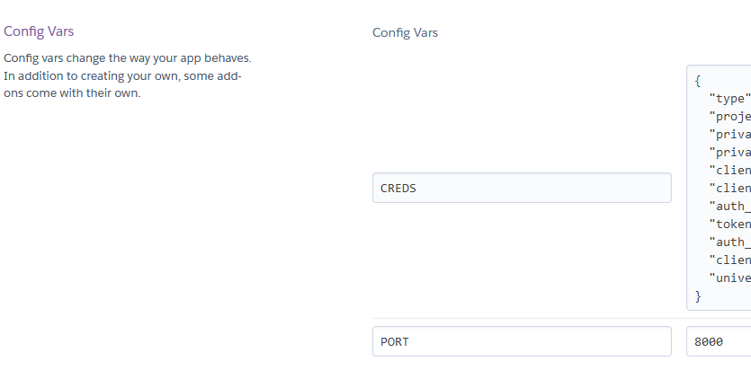

5. Navigate to the "Buildpacks" section of this page and add Python as a buildpack, and then the nodejs buildpack, so that Python is above nodejs

Image

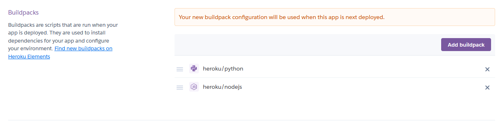

6. Go to the "Deploy" page and select GitHub as a deploy method, log in via GitHub and then select the desired repository

Image

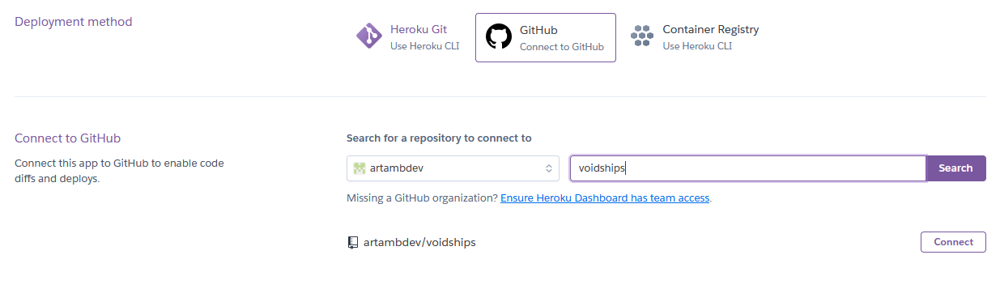

7. Go to "Manual deploy", make sure the main branch is selected, and click "Deploy"

Image

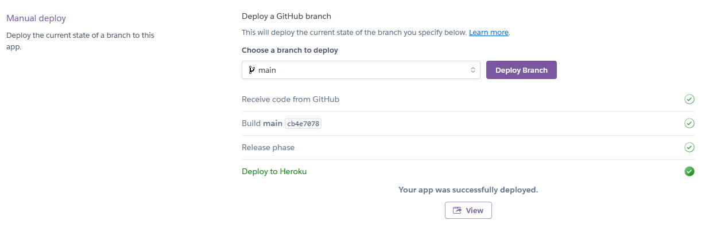

### Forking
On this project's repository, at the upper-right-hand side, there is a "fork" button to create a fork of it.

### Cloning
On this project's repository, at the upper-right-hand side, there is a "Code" button. To clone the project, click the button and:
- Choose between HTTPS, SSH or GitHub CLI as preferred and click the "Copy url to clipboard" button
- Open Git Bash
- Set the working directory to where the cloned project should be
- Type "git clone " followed by the copied URL
- Hit enter to create the cloned project

## Credits
Technology used:
- Languages: Python
- IDE: GitPod
- Version control: GitHub
- Deployment: Heroku
- Flowchart: Lucidchart

Third party libraries:
- <a href="https://pypi.org/project/colorama/">Colorama</a> for coloured text

Code:
- Code for Python terminal provided by Code Institute

Other:
- http://www.patorjk.com for ASCII art generator used for the logo
- Mo Shami for mentoring, guidance and feedback throughout the project.